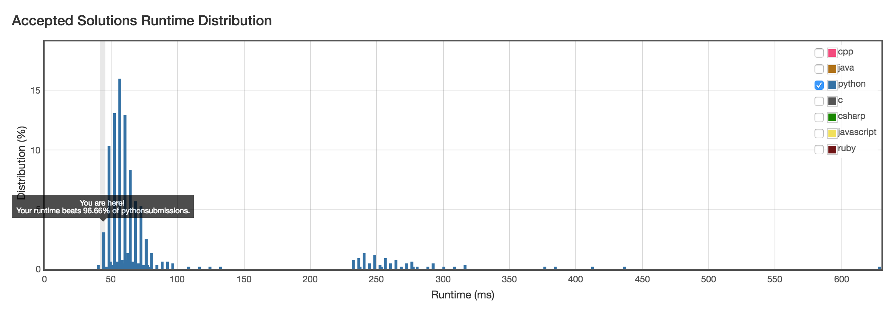

# 14. Longest Common Prefix

## Problem
- Write a function to find the longest common prefix string amongst an array of strings.

## Solution

```python
class Solution(object):
    def longestCommonPrefix(self, strs):
        """
        :type strs: List[str]
        :rtype: str
        """
        if len(strs) < 1: return ''
        elif len(strs) == 1: return strs[0]
        s, i, j = strs[0], 0, 1
        while i < len(s):
            while j < len(strs):
                if i >= len(strs[j]) or strs[j][i] != s[i]:
                    return strs[0][:i]
            i += 1
            j += 1
        return strs[0][:i]
```

Time complexity: O(mn), n strs with average length of m.

---

Accelerated greedy solution:

```python
class Solution(object):
    def longestCommonPrefix(self, strs):
        """
        :type strs: List[str]
        :rtype: str
        """
        if len(strs) < 1: return ''
        elif len(strs) == 1: return strs[0]
        s = strs[0]
        for i in xrange(1, len(strs)):
            l = min(len(s), len(strs[i]))
            while strs[i][:l] != s[:l]: l -= 1
            s = s[:l]
        return s
```

Time complexity: same O(mn).



---

Divide and conquer solution:
- Divide: cut the strs array in half
- Conquer: calculate the long common prefix for sub-parts.
- Combine: merge the results from sub-parts.

Time complexity: T(n) = 2T(n/2) + O(m), which is still O(mn).

---

[More algorithms](https://leetcode.com/articles/longest-common-prefix/) on this problem.
