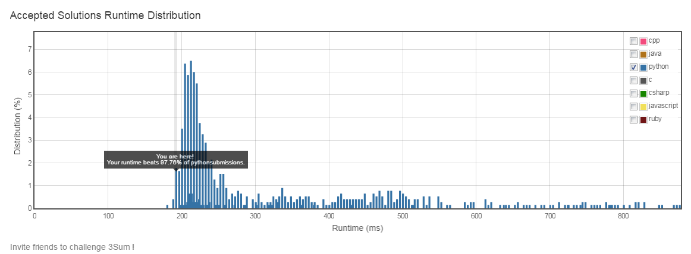

# 15. 3Sum

## Problem
- Given an array S of n integers, are there elements a, b, c in S such that a + b + c = 0?
- Find all unique triplets in the array which gives the sum of zero.
- The solution set must not contain duplicate triplets.
- Exampel:

    > For example, given array S = [-1, 0, 1, 2, -1, -4],
    > 
    > A solution set is:
    > 
    > [
    > 
    > [-1, 0, 1],
    > 
    > [-1, -1, 2]
    > 
    > ]

## Solution

- O(n^2) solution:

```python
class Solution(object):
    def threeSum(self, nums):
        """
        :type nums: List[int]
        :rtype: List[List[int]]
        """
        result = []
        nums.sort()
        keys = nums
        for i in xrange(len(keys) - 2):
            if i != 0 and keys[i] == keys[i-1]:
                continue
            n1 = keys[i]
            if n1 * 3 > 0:
                break
            j, k = i + 1, len(keys) - 1
            while j < k:
                n2, n3 = keys[j], keys[k]
                if n3 * 3 < 0:
                    break
                s = n1 + n2 + n3
                if s == 0:
                    result.append([n1, n2, n3])
                    j += 1
                    k -= 1
                    while j < k and keys[j] == keys[j-1]:
                        j += 1
                    while j < k and keys[k] == keys[k+1]:
                        k -= 1
                elif s < 0:
                    j += 1
                else:
                    k -= 1
        return result
```


