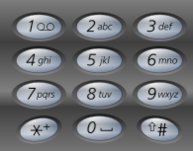

# 17. Letter Combinations of a Phone Number

## Problem
- Given a digit string, return all possible letter combinations that the number could represent.
- A mapping of digit to letters (just like on the telephone buttons) is given below.



> Input:Digit string "23"
> Output: ["ad", "ae", "af", "bd", "be", "bf", "cd", "ce", "cf"].

- Although the above answer is in lexicographical order, your answer could be in any order you want.


## Solution

Backtracking:

```python
class Solution(object):
    def letterCombinations(self, digits):
        """
        :type digits: str
        :rtype: List[str]
        """
        def fill(n):
            if n == l:
                result.append(''.join(combination))
                return
            for cs in ds[digits[n]]:
                for c in cs:
                    combination[n] = c
                    fill(n+1)

        ds = {'2': 'abc', '3': 'def', '4': 'ghi', '5': 'jkl', '6': 'mno', '7': 'pqrs', '8': 'tuv', '9': 'wxyz'}
        l = len(digits)
        if l < 1:
            return []
        combination = ['x'] * l
        result = []
        fill(0)
        return result
```
