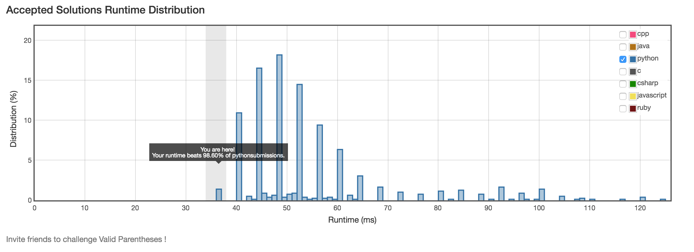

# 20. Valid Parentheses

## Problem
- Given a string containing just the characters '(', ')', '{', '}', '[' and ']', determine if the input string is valid.
- The brackets must close in the correct order, "()" and "()[]{}" are all valid but "(]" and "([)]" are not.

## Solution

```python
class Solution(object):
    def isValid(self, s):
        """
        :type s: str
        :rtype: bool
        """
        if len(s) % 2 != 0:
            return False
        tmp = []
        for c in s:
            if c == '(' or c == '[' or c == '{':
                tmp.append(c)
            else:
                if len(tmp) == 0 or abs(ord(c) - ord(tmp.pop())) > 2:
                    return False
        return len(tmp) == 0
```


