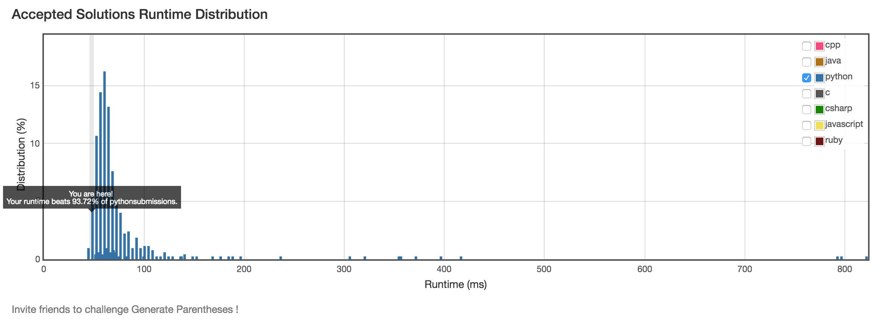

# 22. Generate Parentheses

## Problem
- Given n pairs of parentheses, write a function to generate all combinations of well-formed parentheses.

> For example, given n = 3, a solution set is:
> 
> [
>   "((()))",
>   "(()())",
>   "(())()",
>   "()(())",
>   "()()()"
> ]

## Solution

- Backtracking, time complexity O(n!):

```python
class Solution(object):
    def generateParenthesis(self, n):
        """
        :type n: int
        :rtype: List[str]
        """
        def valid(s):
            stack = []
            for c in s:
                if c == '(':
                    stack.append(c)
                else:
                    if len(stack) == 0 or stack.pop() != '(':
                        return False
            return len(stack) == 0

        def fill(d):
            if d == (n << 1):
                s = ''.join(tmp)
                if valid(s):
                    result.append(s)
                return
            if tmp[0] == ')':
                return
            if d == len(tmp)-1 and tmp[d] == '(':
                return
            if tmp[:d].count('(') > n or tmp[:d].count(')') > n:
                return
            for c in '()':
                tmp[d] = c
                fill(d+1)

        tmp = [''] * (n << 1)
        result = []
        fill(0)
        return result
```

- Binary tree encoding, time complexity T(n) = 2T(n-1) + O(1) --> O(2^n):

```python
class Solution(object):
    def generateParenthesis(self, n):
        """
        :type n: int
        :rtype: List[str]
        """
        def fill(result, s, l, r):
            if l == 0 and r == 0:
                result.append(s)
                return
            if l:
                fill(result, s+'(', l-1, r+1)
            if r:
                fill(result, s+')', l, r-1)
        result = []
        fill(result, '', n, 0)
        return result
```

Take n=2 as an example:



