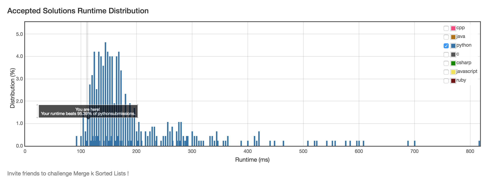

# 23. Merge k Sorted Lists

## Problem
- Merge k sorted linked lists and return it as one sorted list.
- Analyze and describe its complexity.

## Solution
- Divide & conquer:

```python
class Solution(object):
    def mergeKLists(self, lists):
        """
        :type lists: List[ListNode]
        :rtype: ListNode
        """
        def dc(l):
            mid = len(l) >> 1
            h, t = l[:mid], l[mid:]
            if len(h) > 1:
                h = dc(h)
            if len(t) > 1:
                t = dc(t)

            if len(h) == 0:
                return t
            if len(t) == 0:
                return h
            dummy = ListNode(0)
            cur, n1, n2 = dummy, h[0], t[0]
            while n1 or n2:
                v1 = n1.val if n1 is not None else None
                v2 = n2.val if n2 is not None else None
                if v1 is not None and v2 is not None:
                    if v1 <= v2:
                        cur.next = n1
                        n1 = n1.next
                    else:
                        cur.next = n2
                        n2 = n2.next
                    cur = cur.next
                elif v1 is not None:
                    cur.next = n1
                    break
                else:
                    cur.next = n2
                    break
            return [dummy.next]
        if len(lists) == 0:
            return None
        return dc(lists)[0]
```

> Time complexity:
> 
> T(n) = 2T(n/2) + O(m), where n is the number of different lists, m is the average number of ListNodes:
> 
> if m = theta(n), this is nlog(n);
> 
> else, max(O(n), O(m)).

- Heap solution:

```python
class Solution(object):
    def mergeKLists(self, lists):
        """
        :type lists: List[ListNode]
        :rtype: ListNode
        """
        from heapq import heapify, heappop, heapreplace
        dummy = ListNode(0)
        cur = dummy
        h = [(n.val, n) for n in lists if n]
        heapify(h)  # O(n)
        while h:  #O(n)
            _, n = h[0]
            if n.next is None:
                heappop(h)
            else:
                heapreplace(h, (n.next.val, n.next))  # O(log(m))
            cur.next = n
            cur = cur.next
        return dummy.next
```

Time complexity: O(nlog(m)), where n is the total num of nodes and m is the number of lists.


