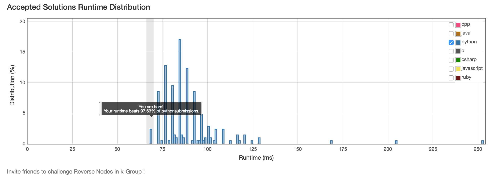

# 25. Reverse Nodes in k-Group

## Problem
- Given a linked list, reverse the nodes of a linked list k at a time and return its modified list.
- If the number of nodes is not a multiple of k then left-out nodes in the end should remain as it is.
- You may not alter the values in the nodes, only nodes itself may be changed.
- Only constant memory is allowed.

> For example,
> 
> Given this linked list: 1->2->3->4->5
> 
> For k = 2, you should return: 2->1->4->3->5
> 
> For k = 3, you should return: 3->2->1->4->5

## Solution

- O(n) time & O(1) space:

```python
# Definition for singly-linked list.
class ListNode(object):
    def __init__(self, x):
        self.val = x
        self.next = None

class Solution(object):
    def reverseKGroup(self, head, k):
        """
        :type head: ListNode
        :type k: int
        :rtype: ListNode
        """
        def reverse(head, end):
            start, s2 = head.next, head.next
            b2 = end.next
            end.next = None
            pre, cur = start, start.next
            while cur is not None:
                pre.next = cur.next
                cur.next = start
                start = cur
                cur = pre.next
            head.next = start
            s2.next = b2
            return s2

        dummy = ListNode(0)
        dummy.next = head
        i, start, stop = 0, dummy, dummy
        while stop:
            if i == k:
                i = 0
                start = stop = reverse(start, stop)
            else:
                i += 1
                stop = stop.next
        return dummy.next
```

- O(n) in time & space:

Note that this solution is taken from [here](https://discuss.leetcode.com/category/33/reverse-nodes-in-k-group).

```python
class Solution(object):
    def reverseKGroup(self, head, k):
        """
        :type head: ListNode
        :type k: int
        :rtype: ListNode
        """
        cur, cnt = head, 0
        while cur is not None and cnt < k:
            cur = cur.next
            cnt += 1
        if cnt == k:
            cur = self.reverseKGroup(cur, k)
            while k:
                tmp = head.next
                head.next = cur
                cur = head
                head = tmp
                k -= 1
            head = cur
        return head
```

- iterative version of solution 2, O(n) time & O(1) space:

```python
class Solution(object):
    def reverseKGroup(self, head, k):
        """
        :type head: ListNode
        :type k: int
        :rtype: ListNode
        """
        def rev(start, stop, k):
            while k:
                tmp = start.next
                start.next = stop
                stop = start
                start = tmp
                k -= 1
            return stop, start

        dummy = ListNode(0)
        dummy.next = head
        preHead = None
        cur, cnt = head, 0
        while cur is not None:
            while cur is not None and cnt < k:
                cur = cur.next
                cnt += 1
            if cnt == k:
                beg, end = rev(head, cur, cnt)
                if preHead:
                    preHead.next = beg
                else:
                    dummy.next = beg
                cnt = 0
                preHead = head
                head = cur = end
        return dummy.next
```


