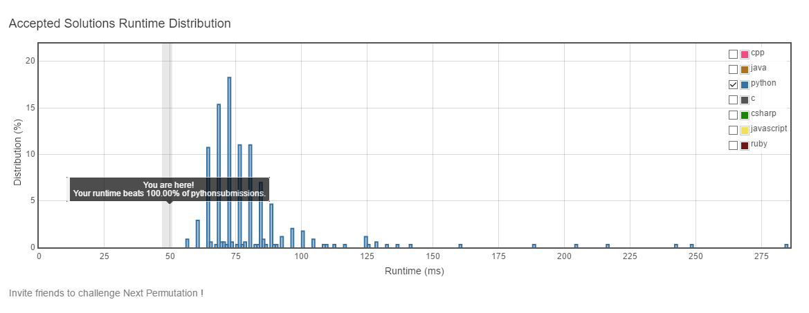
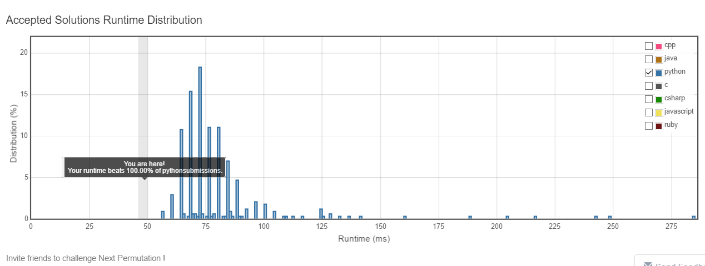

# Next Permutation

## Problem
- Implement next permutation, which rearranges numbers into the lexicographically next greater permutation of numbers.
- If such arrangement is not possible, it must rearrange it as the lowest possible order (ie, sorted in ascending order).
- The replacement must be in-place, do not allocate extra memory.

> Example:
> 
> 1,2,3 → 1,3,2
> 
> 3,2,1 → 1,2,3
> 
> 1,1,5 → 1,5,1

## Solution
```python
class Solution(object):
    def nextPermutation(self, nums):
        """
        :type nums: List[int]
        :rtype: void Do not return anything, modify nums in-place instead.
        """
        left = None
        for i in xrange(len(nums)-1, 0, -1):
            if nums[i-1] < nums[i]:
                left = i-1
                break
        if left is not None:
            for i in xrange(len(nums)-1, -1, -1):  ## optimization space!! [left+1, end) is sorted, binary search can be used here
                if nums[i] > nums[left]:
                    nums[left], nums[i] = nums[i], nums[left]
                    break
            left += 1
            right = len(nums)-1
            while left < right:
                nums[left], nums[right] = nums[right], nums[left]
                left += 1
                right -= 1
        else:
            nums.sort()
```

**Finally, first 100%**


## Refined solution
```python
class Solution(object):
    def nextPermutation(self, nums):
        """
        :type nums: List[int]
        :rtype: void Do not return anything, modify nums in-place instead.
        """
        left = None
        for i in xrange(len(nums)-1, 0, -1):
            if nums[i-1] < nums[i]:
                left = i-1
                break
        if left is not None:
            beg, end = left+1, len(nums)-1
            while beg+1 < end:
                mid = (beg+end) >> 1
                if nums[mid] > nums[left]:
                    beg = mid
                else:
                    end = mid
            if nums[end] > nums[left]:
                nums[end], nums[left] = nums[left], nums[end]
            else:
                nums[beg], nums[left] = nums[left], nums[beg]

            left += 1
            right = len(nums)-1
            while left < right:
                nums[left], nums[right] = nums[right], nums[left]
                left += 1
                right -= 1
        else:
            nums.sort()
```

**Second 100%**

