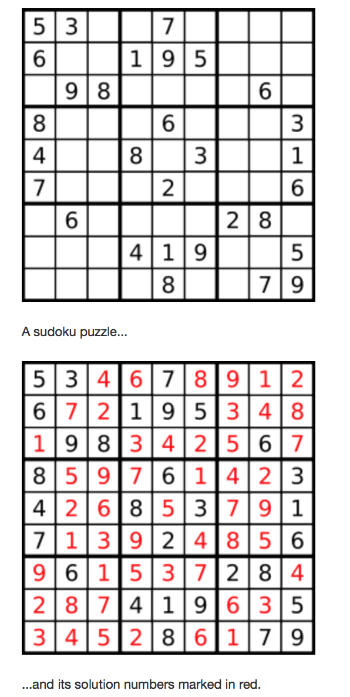

# 37. Sudoku Solver

## Problem
- Write a program to solve a Sudoku puzzle by filling the empty cells.
- Empty cells are indicated by the character '.'.
- You may assume that there will be only one unique solution.
- Example:

    

## Solution

Same idea, back tracking, as 8 queens problem:

```python
class Solution(object):
    def solveSudoku(self, board):
        """
        :type board: List[List[str]]
        :rtype: void Do not return anything, modify board in-place instead.
        """

        def isValid(r, c):
            v = board[r][c]
            for i in range(9):
                if (i!=r and board[i][c]==v) or (i!=c and board[r][i]==v):
                    return False
            gr, gc = r/3*3, c/3*3
            for i in range(gr, gr+3):
                for j in range(gc, gc+3):
                    if board[i][j]==v and (i!=r or j!=c):
                        return False
            return True

        def solve(r, c):
            if r == 9:
                return True

            nextR, nextC = (r, c+1) if c != 8 else (r+1, 0)

            if board[r][c] != '.':
                return solve(nextR, nextC) if isValid(r, c) else False

            for i in range(1, 10):
                board[r][c] = str(i)
                if isValid(r, c) and solve(nextR, nextC):
                    return True

            board[r][c] = '.'  # remember to reset
            return False

        solve(0, 0)
```
