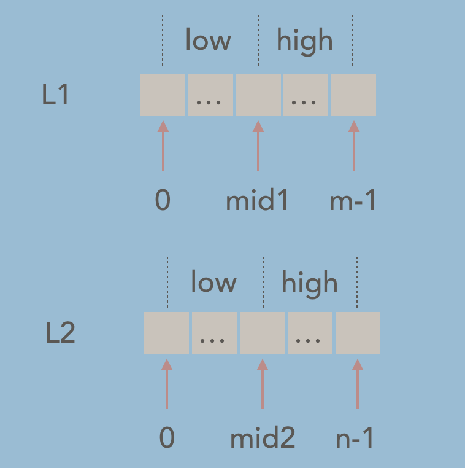
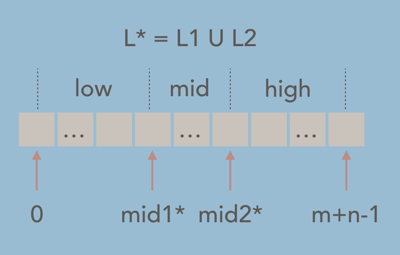
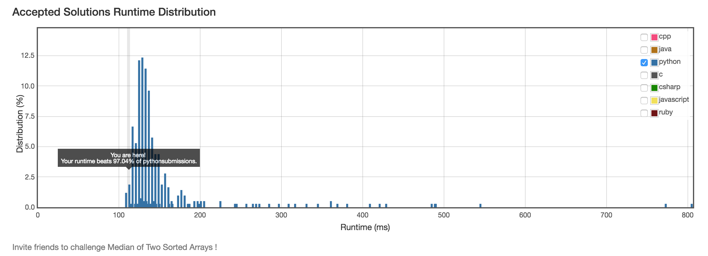

### Analysis

* Basic setups

  > - We have 2 **sorted** lists, L1 and L2.
  > - L1 has m elements, and L2 has n elements, m and n can be different. 
  > - Our goal is to find the median of the union of L1 and L2.
  > - O(log(m+n)) time complexity algorithm is required.


* O(m+n) solution

  > * Using merge part of the merge sort, we can easily get a O(n) solution by first building a sorted union of L1 and L2 in O(n) then return the median of it. And its space complexity is O(n).


  > * Or we can just use two pointers to iterate L1 and L2 correspondingly, and by comparing the values we can know the final positions of the elements in the union list. This approach reduces the space complexity to O(1).

* O(log(m+n)) solution

  > - At first glance, T(n) = T(n/2) + O(1) will give us a O(log(n)) solution, so it hints us to use some strategies to drop half elements each time, and we are not going to do more than O(1) extra stuff.
  > - If we want to solve a problem elegently, we need to understand it very well. Median of a sorted list of numbers, is the middle point of the list, which separates the list into two parts with equal length. 
  > - Based on the first part of the above O(m+n) solution, if we can build the union of L1 and L2 in O(log(m+n)), we are done. But we cannot, we have to iterate all elements of L1 and L2. 
  > - However, the second part of above O(m+n) solution also hints us to count, if we can find the final position of elements in the union of L1 and L2 in O(log(m+n)) without creating the union, we are solving this in O(log(m+n)) as well. And in this case, we can!!! Now recalls the select algorithm from the quick sort algorithm, which can select the kth elememt in a unsorted array in O(n).

* Finding k-th element in L1 and L2 in O(log(m+n))

  > - Addition setups:
  >
  >   - k is zero-based index
  >   - k is valid, which means 0 <= k < m+n
  >
  > - Base case:
  >
  >   - If L1 is empty, return L2[k].
  >   - If L2 is empty, return L1[k].
  >   - (Note: L1 and L2 can not both be empty, or it violates 0 <= k < m+n.)
  >
  > - Reduction steps:
  >
  >   - Find the middle indices of L1 and L2, (note that we make no assumptions on L1 and L2 having odd or even number of elements, since the algorithm works in all cases):
  >
  >     ```python
  >     mid1 = len(l1) >> 1
  >     mid2 = len(l2) >> 1
  >     ```
  >
  >   - Drop half elements:
  >
  >     * As we have mid1 and mid2, we can split L1 and L2 into 4 parts, noted as low(L1), high(L1), low(L2) and high(L2). Since we are trying to build a O(log(m+n)) solution, we have to drop at least one of the four parts each time.
  >
  >       
  >
  >
  >     *  Since we are trying to get the k-th element in the union of L1 and L2, why not draw the union list and do some analysis on the **relationships among mid1, mid2 and k**. Let us assume **L1[mid1] <= L2[mid2]** and name our final sorted union list L*.
  >
  >       
  >
  >       **Observations:**
  >
  >       1. the range of k: [0, m+n-1].
  >
  >       2. L1[mid1] == L\*[mid1\*], low(L1) is part of low(L\*).
  >
  >       3. L2[mid2] == L\*[mid2\*], high(L2) is part of high(L\*).
  >
  >       4. The range of mid1\*: [mid1, mid1+mid2].
  >
  >          > 1. When min(L2) > L1[mid1], no element of L2 gets to the low(L\*), low(L\*)==low(L1), the lower bound is hit, which is mid1.
  >          > 2. When mid(L\*) contains only two elements, which is L1[mid1] and L2[mid2], low(L\*) contains all the elements from low(L1) and low(L2), which maximize the mid1\* to mid1+mid2.
  >
  >       5. The range of mid2\*: [mid1+mid2**+1**, m+mid2].
  >
  >          > 1. Same as case 2 of mid1\*, when mid1\* + 1 == mid2\*, no element of high(L1) gets to low(L\*), the lower bound is hit, which equals to mid1+mid2+1 *(mid1\* = mid1+mid2)*.
  >          > 2. Same as case 1 of mid1\*, when max(L1) < L2[mid2], no element of high(L1) gets to high(L\*), the upper bound is hit, which equals to m+mid2.
  >
  >       **Sumup:**
  >
  >       1. We are looking for some strategies to **drop half elements**.
  >
  >       2. We are finding the **relationships among mid1, mid2 and k**.
  >
  >       3. Based on observations, we can see:
  >
  >          > * if k > mid1+mid2, which means k is on the right of mid1\*, which means we can drop low(L1) safely and update k (since we are dropping the head elements) to further search the new L1 and L2.
  >          > * if k <= mid1+mid2, likewise, which means k is on the left of mid2\*, which means we can drop high(L2) safely and we do not have to update k to further search the L1 and new L2 since we are dropping the tail elements this time.
  >
  >       **Time complexity analysis:**
  >
  >       * Best case analysis:
  >
  >         > Since each time we drop half element of one array, the algorithm's best running time would be O(log(min(m,n))), which means the shorter array gets selected every time and keeps dropping half elements till empty.
  >
  >       * Worst case analysis:
  >
  >         > When m==n, each time the algorithm selects a different array from last time util one array gets empty and the other contains 1 element. The worst case running time would be O(log(m)+log(n)) = O(log(mn)) <= O(m^2 + 2mn + n^2) = O(2log(m+n)) = O(log(m+n)). Still meets the requirements.

* Result

  * [code](solution.py)

  * leetcode time distribution. *(just for fun;))*

    
