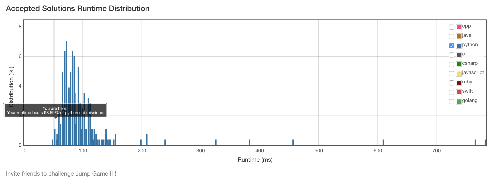

# 45. Jump Game II

# Problem
- Given an array of non-negative integers, you are initially positioned at the first index of the array.
- Each element in the array represents your maximum jump length at that position.
- Your goal is to reach the last index in the minimum number of jumps.

> For example:
> 
> Given array A = [2,3,1,1,4]
> 
> The minimum number of jumps to reach the last index is 2. (Jump 1 step from index 0 to 1, then 3 steps to the last index.)

- You can assume that you can always reach the last index.

## Solution
```python
class Solution(object):
    def jump(self, nums):
        """
        :type nums: List[int]
        :rtype: int
        """
        n, reached, maxR, ret = len(nums), 0, 0, 0
        for i in xrange(n):
            if i > reached:
                if maxR >= n-1: return ret+1
                reached = maxR
                ret += 1
            maxR = max(maxR, i+nums[i])
        return ret
```



## Solution with DP (TLE..)
```python
class Solution(object):
    def jump(self, nums):
        """
        :type nums: List[int]
        :rtype: int
        """
        n = len(nums)
        dp = [0] * n
        for i in xrange(1, n):
            dp[i] = min(dp[j] for j in xrange(i) if j+nums[j]>=i) + 1
        return dp[-1]
```
