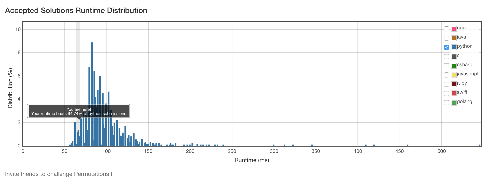

# 46. Permutations

## Problem
- Given a collection of distinct numbers, return all possible permutations.

For example,
[1,2,3] have the following permutations:
[
  [1,2,3],
  [1,3,2],
  [2,1,3],
  [2,3,1],
  [3,1,2],
  [3,2,1]
]

## Solution
```python
class Solution(object):
    def permute(self, nums):
        """
        :type nums: List[int]
        :rtype: List[List[int]]
        """
        def bt(ret, tmpArr, used, n):
            if n == len(nums):
                ret.append(copy.copy(tmpArr))
                return
            for i, x in enumerate(nums):
                if not used[i]:
                    used[i] = True
                    tmpArr[n] = x
                    bt(ret, tmpArr, used, n+1)
                    used[i] = False
        ret, n = [], len(nums)
        bt(ret, [0]*n, [False]*n, 0)
        return ret
```


