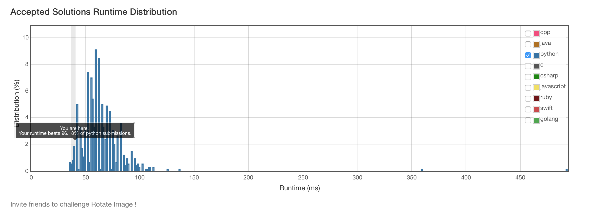

# 48. Rotate Image

## Problem
- You are given an n x n 2D matrix representing an image.
- Rotate the image by 90 degrees (clockwise) in-place.

## Solution
```python
class Solution(object):
    def rotate(self, matrix):
        """
        :type matrix: List[List[int]]
        :rtype: void Do not return anything, modify matrix in-place instead.
        """
        n = len(matrix)-1
        for i in xrange(n):
            for j in xrange(n-i):
                matrix[i][j], matrix[~j][~i] = matrix[~j][~i], matrix[i][j]
        matrix.reverse()
```



## Other Solutions
**ref:[here](https://discuss.leetcode.com/topic/15295/seven-short-solutions-1-to-7-lines)**

```python
class Solution:
    def rotate(self, A):
        A[:] = zip(*A[::-1])  ## not in-place
```

```python
class Solution:
    def rotate(self, A):
        n = len(A)
        for i in range(n/2):
            for j in range(n-n/2):  ## careful n-n/2
                A[i][j], A[~j][i], A[~i][~j], A[j][~i] = \  
                         A[~j][i], A[~i][~j], A[j][~i], A[i][j]  ## ~i == -i-1
```

```python
class Solution:
    def rotate(self, A):
        A.reverse()
        for i in range(len(A)):
            for j in range(i):
                A[i][j], A[j][i] = A[j][i], A[i][j]
```
