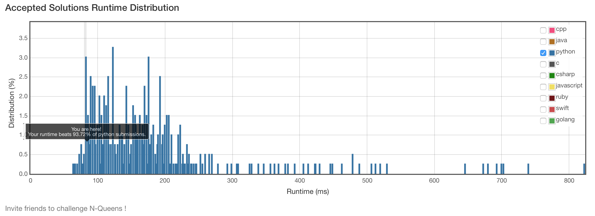

# 51. N-Queens

## Problem
- The n-queens puzzle is the problem of placing n queens on an n×n chessboard such that no two queens attack each other.
- Given an integer n, return all distinct solutions to the n-queens puzzle.
- Each solution contains a distinct board configuration of the n-queens' placement, where 'Q' and '.' both indicate a queen and an empty space respectively.

> For example,
> 
> There exist two distinct solutions to the 4-queens puzzle:
> 
> [
> 
>  [".Q..",  // Solution 1
>  
>   "...Q",
>   
>   "Q...",
>   
>   "..Q."],
> 
>  ["..Q.",  // Solution 2
>  
>   "Q...",
>   
>   "...Q",
>   
>   ".Q.."]
>   
> ]

## Solution
```python
class Solution(object):
    def solveNQueens(self, n):
        """
        :type n: int
        :rtype: List[List[str]]
        """
        def bt(boards, tmpBoard, r, cBools, diag1Bools, diag2Bools):
            if r == n:
                boards.append([''.join(row) for row in tmpBoard])
                return
            for c in range(n):
                d1, d2 = (r+c) % const, (r-c+const) % const
                if not cBools[c] and not diag1Bools[d1] and not diag2Bools[d2]:
                    cBools[c], diag1Bools[d1], diag2Bools[d2] = True, True, True
                    tmpBoard[r][c] = 'Q'
                    bt(boards, tmpBoard, r+1, cBools, diag1Bools, diag2Bools)
                    tmpBoard[r][c] = '.'
                    cBools[c], diag1Bools[d1], diag2Bools[d2] = False, False, False
        boards = []
        const = (n << 1) - 1
        bt(boards, [['.']*n for _ in range(n)], 0, [False]*n, [False]*const, [False]*const)
        return boards
```



## bfs solution
**ref:[here](https://discuss.leetcode.com/topic/20217/fast-short-and-easy-to-understand-python-solution-11-lines-76ms/2)**
> In this problem, whenever a location (x, y) is occupied, any other locations 
> 
> (p, q ) where p + q == x + y or p - q == x - y would be invalid. We can use 
> 
> this information to keep track of the indicators (xy_dif and xy_sum ) of the 
> 
> invalid positions and then call DFS recursively with valid positions only. 

```python
class Solution(object):
    def solveNQueens(self, n):
        def DFS(queens, xy_dif, xy_sum):
            p = len(queens)
            if p==n:
                result.append(queens)
                return
            for q in range(n):
                if q not in queens and p-q not in xy_dif and p+q not in xy_sum:
                    DFS(queens+[q], xy_dif|set([p-q]), xy_sum|set([p+q]))  ## memery consumption
        result = []
        DFS([], set(), set())
        return [["."*i + "Q" + "."*(n-i-1) for i in sol] for sol in result]
```
